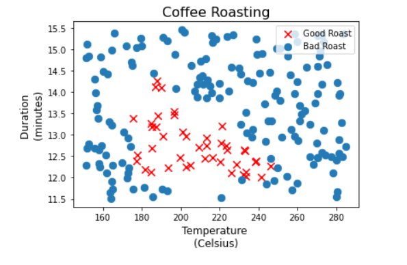

# Coffee-Roast-Deep-Learning
This project includes a 2-layer Deep Learning model using TensorFlow to predict coffee roast outcome based on roast duration and temperature. Inspired by "Advanced Learning Algorithms" course from Stanford University & DeepLearning.AI.

The coffe roast data was artificially created and tiled to increase data size and reduce the number of training epochs. The features in the training set were  normalized using Keras normalization layer using the adapt() function, that learns the mean and variance of the data set. This is is extremly useful in large datasets to accelerate back-propagation.

The network is built by a hidden layer containing 3 neurons, and the output layer containing a single neuron. Both layers use sigmoid activation function.

